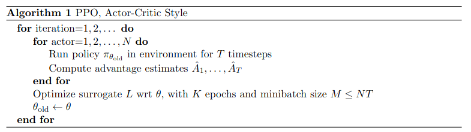

# PPO

Proximal Policy Optimization

## Contents

- [Behaviour](#behaviour)
- [Results](#results)
- [Runs](#runs)
- [References](#inspired-by--references)

## Behaviour



### Assumptions
The paper does not specify the architecture of the value (critic) net, so I am making the assumption that it is the same as the policy (actor) net. 

## Results

To be obtained.

## Runs

To be added.

## Inspired by / References
```bibtex

@misc{schulman2017proximal,
      title={Proximal Policy Optimization Algorithms}, 
      author={John Schulman and Filip Wolski and Prafulla Dhariwal and Alec Radford and Oleg Klimov},
      year={2017},
      eprint={1707.06347},
      archivePrefix={arXiv},
      primaryClass={cs.LG}
}
```
