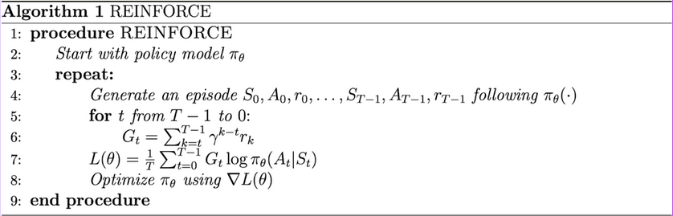

# REINFORCE

Simple implementation of the **RE**ward **I**ncrement **N**on-negative **F**actor times **O**ffset **R**einforcement times **C**haracteristic **E**ligibility (REINFORCE) policy-gradient algorithm. 

## Contents

- [Behaviour](#behaviour)
- [Results](#results)
- [Runs](#runs)
- [References](#inspired-by--references)

## Behaviour



Additional changes, such as using AdamW instead of SGD described above, and normalization of the discounted return, among others.

## Results

Interestingly appears to be less stable than DQN. Should reach 495 average over last 100 episodes within less than 1000 episodes consistently on the Cart Pole problem.

## Runs

To be added.

## Inspired by / References
```bibtex

@misc{ gymnasium_reinforce,
    title={Training using REINFORCE for Mujoco}
    url={https://gymnasium.farama.org/tutorials/training_agents/reinforce_invpend_gym_v26/},
    author={Siddarth Chandrasekar},
}

@misc{ huggingface_reinforce,
    title={Hugging Face Deep RL Course}
    url={https://huggingface.co/learn/deep-rl-course/unit4/hands-on},
    author={Thomas Simonini, et al.},
}

@misc{ openai_spinningup,
    title={OpenAI Spinning Up}
    url={https://spinningup.openai.com/en/latest/spinningup/rl_intro3.html},
    author={Josh Achiam, et al.},
}
```
